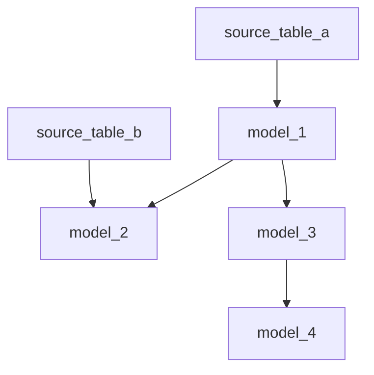

# SQL Lineage Mapper

A Python tool that generates an interactive data lineage diagram from local SQL files.

## What It Does

1. Scans SQL files in a specified folder (including sub-folders)
2. Intelligently extracts table relationships from FROM and JOIN clauses
3. Detects and handles CTEs (Common Table Expressions)
4. Ignores commented SQL lines
5. Generates a Mermaid diagram showing table dependencies
6. Creates an interactive HTML visualization with D3.js
7. Auto-opens in a web browser to explore your data lineage

## Interactive Features

The generated HTML visualization provides:

- Interactive graph with drag-and-drop node positioning
- Search functionality to find specific tables
- Node highlighting to see dependencies
- Zoom and pan capabilities
- Filtering to focus on specific table lineage
- Reset view button to restore the original layout
- Show all button to display all tables after filtering

## Prerequisites

- Python 3.x
- PyYAML package
- Internet connection (for loading the JavaScript libraries)

### JavaScript Dependencies (loaded automatically via CDN)

- D3.js (v7)
- dagre.js
- dagre-d3.js

## Installation

1. Clone the repository:
```bash
git clone https://github.com/caitpj/SQL-WatchPup.git
cd SQL-WatchPup
```

2. Install dependencies:
```bash
pip install -r requirements.txt
```

3. Set up your configurations (see Configuration section below)

4. Create your data lineage:
```bash
python generate_lineage.py
```

## Configuration

Create a `config.yml` file with the following parameters:

```yaml
sql_folder_path: "example-SQL-tables/"   # Path to your SQL files
lineage_output: "output/"                # Where to output generated files
lineage_ui: "ui/"                        # Location of UI template files
```

## Options

- Command line options:
```bash
python generate_lineage.py --no-browser                # Don't auto-open the browser
```

## View Lineage

- View the generated diagram:
    - The tool will automatically open your browser with the interactive visualization
    - You can also manually open the HTML file from the output directory

- If you prefer a static visualization, you can also view the generated Mermaid diagram:
    - Open the output file (lineage.md) in VS Code
    - Install "Markdown Preview Mermaid Support" extension in VS Code
    - Press Ctrl+Shift+V (Cmd+Shift+V on Mac) to preview

## Example Output




## Example Project Structure

```
sql-lineage-mapper/
│
├── generate_lineage.py          # Main script
├── config.yml                   # Configuration file
├── README.md                    # This file
├── example-SQL-tables/          # Directory containing SQL files
│   ├── model_1.sql
│   ├── model_2.sql
│   └── ...
├── ui/                          # UI template files
│   ├── template.html
│   ├── visualization.js
│   └── styles.css
└── output/                      
    ├── lineage.md               # Mermaid diagram
    └── sql_lineage_interactive.html  # Interactive visualization
```

## How to Contribute

Contributions are welcome! Please feel free to submit a Pull Request.