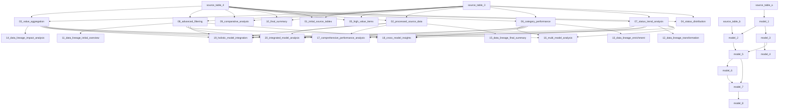

```mermaid
flowchart TD
    source_table_a-->model_1
    07_status_trend_analysis-->19_holistic_model_integration
    07_status_trend_analysis-->17_comprehensive_performance_analysis
    06_category_performance-->16_multi_model_analysis
    source_table_4-->03_value_aggregation
    source_table_3-->01_initial_source_tables
    06_category_performance-->20_integrated_model_analysis
    model_5-->model_6
    source_table_4-->08_advanced_filtering
    03_value_aggregation-->14_data_lineage_impact_analysis
    07_status_trend_analysis-->18_cross_model_insights
    02_processed_source_data-->20_integrated_model_analysis
    06_category_performance-->19_holistic_model_integration
    model_1-->model_2
    02_processed_source_data-->19_holistic_model_integration
    02_processed_source_data-->17_comprehensive_performance_analysis
    06_category_performance-->18_cross_model_insights
    model_6-->model_7
    source_table_3-->03_value_aggregation
    source_table_4-->09_comparative_analysis
    03_value_aggregation-->20_integrated_model_analysis
    source_table_4-->10_final_summary
    source_table_3-->08_advanced_filtering
    source_table_4-->05_high_value_items
    source_table_4-->02_processed_source_data
    model_3-->model_4
    08_advanced_filtering-->11_data_lineage_initial_overview
    03_value_aggregation-->19_holistic_model_integration
    03_value_aggregation-->17_comprehensive_performance_analysis
    source_table_b-->model_2
    model_2-->model_5
    03_value_aggregation-->18_cross_model_insights
    source_table_3-->09_comparative_analysis
    source_table_3-->10_final_summary
    source_table_3-->05_high_value_items
    source_table_4-->06_category_performance
    07_status_trend_analysis-->12_data_lineage_transformation
    source_table_3-->02_processed_source_data
    model_5-->model_7
    model_7-->model_8
    source_table_4-->07_status_trend_analysis
    source_table_4-->04_status_distribution
    08_advanced_filtering-->16_multi_model_analysis
    source_table_3-->06_category_performance
    02_processed_source_data-->15_data_lineage_final_summary
    model_1-->model_3
    08_advanced_filtering-->20_integrated_model_analysis
    06_category_performance-->13_data_lineage_enrichment
    08_advanced_filtering-->19_holistic_model_integration
    source_table_3-->07_status_trend_analysis
    source_table_4-->01_initial_source_tables
    source_table_3-->04_status_distribution
    07_status_trend_analysis-->16_multi_model_analysis
    08_advanced_filtering-->18_cross_model_insights
    07_status_trend_analysis-->20_integrated_model_analysis
    model_3-->model_5
```