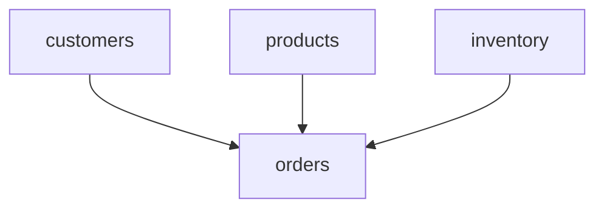

# SQL Lineage Mapper

A Python tool that analyzes SQL files and generates a Mermaid diagram showing table dependencies.

## Features

- Scans SQL files recursively in a specified directory
- Extracts table relationships from FROM and JOIN clauses
- Ignores commented SQL lines
- Generates a Mermaid diagram showing table dependencies
- Case-insensitive table name matching

## Prerequisites

- Python 3.x
- PyYAML package

## Installation

1. Clone the repository:
```bash
git clone <repository-url>
cd sql-lineage-mapper
```

2. Install required packages:
```bash
pip install pyyaml
```

## Configuration

Create a `config.yml` file:
```yaml
sql_folder_path: "path/to/your/sql/files"
output_path: "docs/lineage.md"
```

## Usage

1. Run the script:
```bash
python sql_lineage_mapper.py
```

2. View the generated diagram:
   - Open the output file (default: lineage.md) in VS Code
   - Install "Markdown Preview Mermaid Support" extension in VS Code
   - Press Ctrl+Shift+V (Cmd+Shift+V on Mac) to preview

## Example Output



## Project Structure

```
sql-lineage-mapper/
│
├── sql_lineage_mapper.py    # Main script
├── config.yml              # Configuration file
├── README.md              # This file
└── .gitignore            # Git ignore file
```
